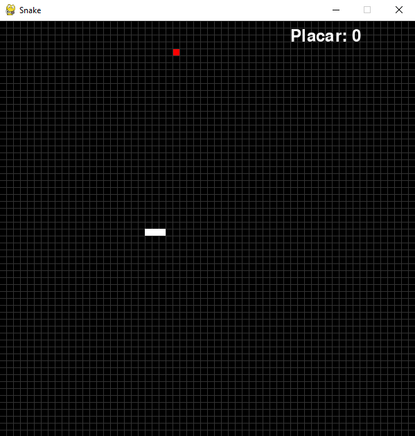

<h1 align="center"> Snake </h1>

Jogo Snake criado utilizando a linguagem Python, com base nos ensinamentos do [repositório - Pygame-Snake](https://github.com/filhoweuler/Pygame-Snake) do perfil [filhoweuler](https://github.com/filhoweuler) no GitHub. 

  <a href="#-tecnologias">🚀 Tecnologias</a>&nbsp;&nbsp;&nbsp;|&nbsp;&nbsp;&nbsp;
  <a href="#-projeto">💻 Projeto</a>&nbsp;&nbsp;&nbsp;|&nbsp;&nbsp;&nbsp;
  <a href="#-execução">🔖 Execução</a>&nbsp;&nbsp;&nbsp;|&nbsp;&nbsp;&nbsp;
  <a href="#memo-licença">:memo: Licença</a>

 

  

## 🚀 Tecnologias

Esse projeto foi desenvolvido com as seguintes tecnologias:

- Python

## 💻 Projeto

Snake (Serpente, também conhecido como "jogo da cobrinha") é um jogo que ficou conhecido por diversas versões cuja versão inicial começou com o jogo Blockade de 1976, sendo feitas várias imitações em vídeo-games e computadores. o jogo foi lançado para celulares Nokia em 1998 e se tornou popular.

O jogador controla uma longa e fina criatura que se arrasta pela tela, coletando comida (neste caso uma maçã), não podendo colidir com seu próprio corpo ou as "paredes" que cercam a área de jogo. Cada vez que a serpente come uma maçã, sua cauda cresce, aumentando a dificuldade do jogo. O usuário controla a direção da cabeça da serpente (para cima, para baixo, esquerda e direita) e seu corpo segue.

## 🔖 Execução

Você pode testar o projeto, seguindo o passo-a-passo abaixo: 
<ul>
<li>Clone o repositório do projeto</li>
<li>Na pasta do projeto, abra um terminal e execute o comando: <code>pip install pygame</code></li>
<li>Após a instalação da biblioteca, rode o jogo com o comando: <code>python snake.py</code></li>
</ul>

## :memo: Licença

Esse projeto está sob a licença MIT.

---

Desenvolvido por [Thiago Honorato](https://www.linkedin.com/in/honoratothiago/)
